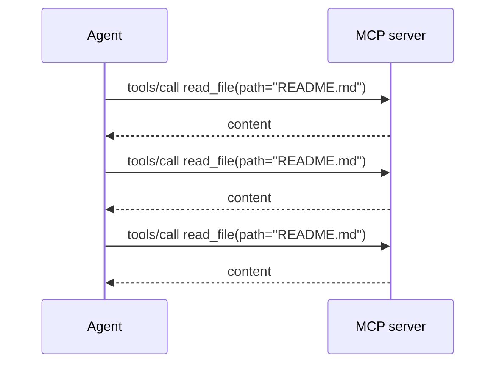
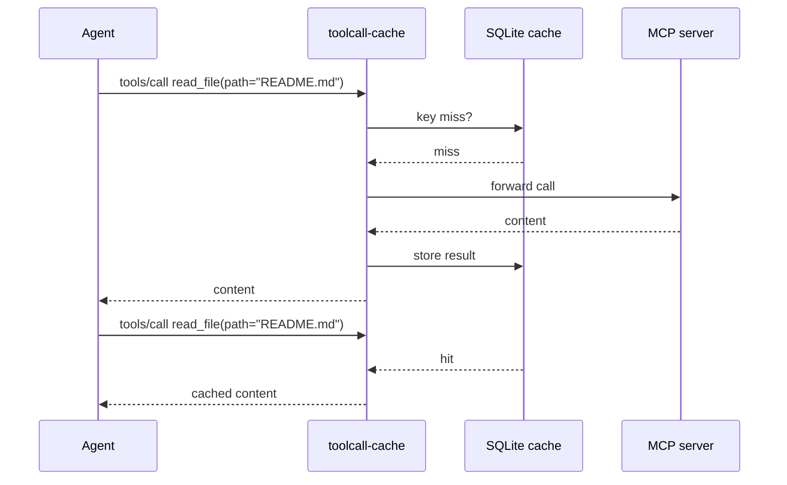

<p align="center">
  
</p>

<p align="center">
  <a href="https://github.com/Victorchatter/toolcall-cache/blob/main/LICENSE">
    
  </a>
  
  
</p>

# toolcall-cache

**A local, content-addressed cache for MCP tool results.**

Drop it between any MCP-using agent and any MCP server. For deterministic tools — file reads, greps, GETs, listings — repeated calls with the same arguments return the cached result instead of hitting the upstream server again. Less spend, lower latency, and zero external dependencies.

---

## What problem this solves

Long agent sessions repeat the same tool calls over and over:

- Re-reading the same `README.md` on every planning loop.
- Re-grepping the same symbol across a codebase.
- Re-fetching the same HTTP endpoint for context.

Each call costs time, tokens, and (for paid MCP servers or API-backed tools) money. There is no framework-agnostic cache layer that works across Claude Code, Codex, Cursor, or any other MCP client.

`toolcall-cache` is that missing layer.


### Without the cache



### With toolcall-cache




---

## How it works

`toolcall-cache` runs as a transparent MCP proxy. Your agent's MCP config points at the cache, and the cache points at the real MCP server.


1. **Agent sends** a `tools/call` request.
2. **Proxy checks** whether the tool is cacheable and whether a fresh entry exists.
3. **Cache hit:** the proxy returns the stored result directly — no upstream traffic.
4. **Cache miss:** the proxy forwards the call, stores the successful response, and returns it.
5. Non-tool traffic (`initialize`, `tools/list`, notifications, etc.) passes through untouched.

Cache key:

```
sha256(canonical_json({server_id, tool_name, arguments}))
```

The `server_id` prevents collisions between tools with the same name on different upstream servers.

---

## Methodology: what to use it for

Use `toolcall-cache` for **deterministic, read-only tools** where the answer does not change between calls in the same session:

| Good fit | Why |
|----------|-----|
| `read_file` | File contents are stable for the lifetime of the cache. |
| `grep`, `search` | Re-searching the same query returns the same hits. |
| `list_directory` | Directory listings change rarely during a session. |
| `http_get` | Safe for idempotent GET endpoints. |
| `git_status`, `git_diff` | Repeated status checks are common in coding agents. |

**Do not cache** tools that mutate state, return time-sensitive data, or produce random output:

| Avoid | Why |
|-------|-----|
| `write_file`, `send_email` | Side effects must run every time. |
| `now`, `date`, `time` | Values change continuously. |
| `random*` | Non-deterministic by definition. |
| `delete*` | Destructive operations must reach the server. |

The default denylist (`*_write*`, `send*`, `delete*`, `random*`, `time*`, `now*`, `date*`) blocks these automatically. You can override it, but the denylist always wins over the allowlist for safety.

---

## Installation

```bash
pipx install .
```

Or install from source:

```bash
git clone https://github.com/Victorchatter/toolcall-cache.git
cd toolcall-cache
pip install -e .
```

No external dependencies — just Python 3.10+ and the stdlib.

---

## Quick start

### Stdio MCP server

Point your agent at the proxy instead of the upstream server:

```bash
toolcall-cache start \
  --transport stdio \
  --upstream "npx -y @modelcontextprotocol/server-filesystem /path/to/project" \
  --allowlist read_file,read,grep,list_directory \
  --ttl 3600
```

Then configure your MCP client to use this command as its server.

### HTTP MCP server

```bash
toolcall-cache start \
  --transport http \
  --upstream http://localhost:3001 \
  --allowlist read_file,search,http_get \
  --port 8787
```

Your agent connects to `http://localhost:8787`; the proxy forwards to `http://localhost:3001`.

### CLI management

```bash
# Show cache statistics
toolcall-cache stats

# List cached entries
toolcall-cache list

# Invalidate all cached results for one tool
toolcall-cache invalidate read_file

# Clear everything
toolcall-cache clear
```

---

## Example: stop paying for the same grep twice

Imagine a coding agent working on a large repo. It keeps asking:

```json
{"jsonrpc":"2.0","id":7,"method":"tools/call","params":{"name":"grep","arguments":{"pattern":"TODO","path":"src"}}}
```

Each call scans the filesystem and returns the same 50 matches. Over a 30-minute session the agent issues this query 12 times.

**Without `toolcall-cache`:** 12 upstream scans.

**With `toolcall-cache`:** 1 upstream scan + 11 instant cache hits.

Start the proxy with `grep` allowlisted:

```bash
toolcall-cache start \
  --transport stdio \
  --upstream "python my_mcp_server.py" \
  --allowlist grep,read_file \
  --ttl 1800
```

The first `grep` runs normally. Every identical repeat returns in microseconds from the local SQLite cache.

---

## Cache policy

The default policy is **allowlist-first and denylist-vetoes**:

- A tool is cached only if it is **explicitly allowlisted** (`--allowlist`) **or** its MCP `annotations` declare `cacheable: true`.
- The **denylist** (`--denylist`) overrides everything. Default denylist:
  - `*_write*`
  - `send*`
  - `delete*`
  - `random*`
  - `time*`
  - `now*`
  - `date*`

This design makes the safe choice the default: a configuration mistake costs you a cache miss, never a stale or wrong answer.

### MCP annotation example

If your MCP server advertises:

```json
{
  "name": "read_file",
  "annotations": {"cacheable": true}
}
```

`read_file` will be cached even without `--allowlist read_file`.

---

## CLI reference

```text
toolcall-cache --help
toolcall-cache start --help
```

| Command | Purpose |
|---------|---------|
| `start` | Run the MCP proxy. |
| `clear` | Delete every cached entry. |
| `invalidate <tool>` | Delete entries for a single tool name. |
| `list` | Show cached entries. |
| `stats` | Show aggregate hits, entries, and per-tool stats. |

Common options:

| Flag | Default | Description |
|------|---------|-------------|
| `--db` | `~/.toolcall-cache/toolcall-cache.db` | SQLite cache file. |
| `--allowlist` | *(empty)* | Comma-separated tool names to cache. |
| `--denylist` | `*_write*,send*,delete*,random*,time*,now*,date*` | Glob patterns never cached. |
| `--ttl` | `3600` | Cache TTL in seconds. |
| `--server-id` | `default` | Server identity in cache keys. |

---

## Development & testing

Run the built-in self-test:

```bash
python selfcheck.py
```

It spawns a fake MCP server with a cacheable `read_file` and a non-cacheable `now`, then asserts:

- The second `read_file` call hits the cache (upstream counter stays at 1).
- Every `now` call reaches upstream (counter increments).

Regenerate README diagrams:

```bash
python docs/diagrams/generate.py
```

---

## Project structure

```
toolcall-cache/
├── src/toolcall_cache/
│   ├── cache.py           # SQLite storage
│   ├── key.py             # Canonical JSON + SHA256 keys
│   ├── policy.py          # Allowlist / denylist / annotations
│   ├── proxy.py           # MCP message classification
│   ├── cli.py             # toolcall-cache command
│   ├── server.py          # Transport wiring
│   └── transports/
│       ├── stdio.py       # Stdio MCP proxy
│       └── http.py        # HTTP MCP reverse proxy
├── selfcheck.py           # End-to-end test
├── docs/diagrams/         # Generated SVGs
├── pyproject.toml
├── LICENSE
└── README.md
```

---

## License

MIT. See [LICENSE](LICENSE).
